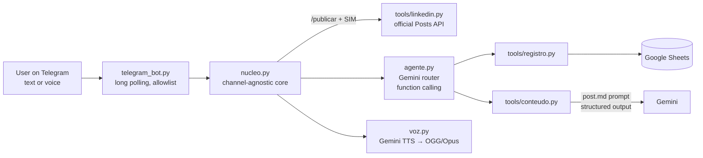

# Ultron: a personal AI agent for LinkedIn career routines

> 🇧🇷 [Leia em português](README.pt-BR.md)

Ultron is a personal AI agent that runs a LinkedIn growth routine end to end: it logs daily activities from text or voice notes, tracks weekly goals in Google Sheets, turns spoken insights into LinkedIn post drafts, and publishes approved posts through the official LinkedIn API. It is used daily through a Telegram bot, with voice replies.

It was built to support a 7-day LinkedIn challenge and an ongoing 15-minute daily routine based on four behaviors: professional brand, finding people, engaging with insights and building relationships.

## What it does

- **Logs the day by voice or text.** "Today I sent 25 invites, 18 to recruiters, and wrote 3 comments" becomes a row in the tracking sheet. "Actually it was 20" corrects it; "10 more invites" adds to it.
- **Reports weekly performance** against goals, highlighting what is furthest behind.
- **Turns a voice note into a post draft.** The draft follows a style guide and a strict faithfulness rule: it never invents metrics, and anything missing or generalized is flagged for review.
- **Revision loop:** adjust, approve or discard the draft through chat.
- **Publishes to LinkedIn** via the official API, only after an explicit two-step confirmation.
- **Replies with voice** (Gemini TTS, an original prebuilt voice), with captions for quick reading.

## Architecture



## Design decisions

**Human in the loop for irreversible actions.** Publishing is not exposed to the model as a tool. It only happens through a deterministic `/publicar` command followed by an explicit "SIM" confirmation, so a misread message can never publish anything.

**Compliant with LinkedIn's terms by design.** LinkedIn does not offer APIs for members to send invitations or comment on other people's posts, and browser automation for that violates its User Agreement. Ultron prepares the thinking work (drafts, notes, tracking) and leaves those clicks to the user. Publishing uses the official "Share on LinkedIn" product with OAuth 2.0.

**Hallucination guardrails in the prompt.** The post prompt prioritizes faithfulness over style and gives the model a legitimate outlet: missing information goes into an `alerts` field instead of being made up. Few-shot examples are explicitly marked as style-only references.

**Deterministic display of generated content.** Drafts are printed by code from a buffer, not relayed by the router model, so the user always sees exactly what was generated.

**Spreadsheet math instead of lookups.** Sheets store dates as serial numbers (days since 1899-12-30). The row for any day is computed as `5 + (date - start).days`, avoiding locale-dependent date parsing.

**Time awareness.** The current date and time (America/Sao_Paulo) are injected into every message, so "today" and "yesterday" resolve correctly even in conversations that cross midnight.

**Resilience to model outages.** Transient errors (429/5xx) are retried with exponential backoff and jitter. If the primary model stays unavailable, the agent switches to a fallback model (Gemini Flash-Lite) while keeping the conversation history, and returns to the primary on the next message.

**Idempotency on failures.** Tools with side effects are tracked per message. If a model fails after a tool already ran (for example, after logging to the sheet), the message is not retried; the user receives a code-generated summary of what was done, and the model is told on the next turn, preventing duplicate entries.

**Channel-agnostic core.** All behavior lives in `nucleo.py` and `agente.py`. Telegram is an adapter; adding WhatsApp or another channel does not change the agent.

## Tech stack

Python · Google Gemini API (`google-genai`: function calling, structured output with Pydantic, native audio input, TTS) · Google Sheets API (`gspread`, service account) · LinkedIn API (OAuth 2.0, Posts API) · Telegram Bot API · PyAV (Opus encoding)

## Project structure

```
├── telegram_bot.py      # Telegram adapter (long polling)
├── nucleo.py            # shared handling logic and publish confirmation flow
├── agente.py            # Gemini router agent with tools
├── voz.py               # text-to-speech and voice note encoding
├── cli.py               # terminal interface (same agent)
├── linkedin_auth.py     # one-time OAuth login
├── planilha.py          # Google Sheets access and layout rules
├── config.py / llm.py   # configuration and Gemini client
├── prompts/
│   ├── ultron.md        # router instructions
│   └── post.md          # post writing guide
└── tools/
    ├── registro.py      # daily log, day lookup, weekly summary
    ├── conteudo.py      # draft, adjust, approve, discard
    └── linkedin.py      # publishing via official API
```

## Running it

1. `python -m venv .venv`, activate it and run `pip install -r requirements.txt`.
2. Copy `.env.example` to `.env` and fill in the keys (Gemini, Google service account, spreadsheet ID, LinkedIn app, Telegram bot).
3. Share the tracking spreadsheet with the service account email.
4. `python linkedin_auth.py` once to authorize publishing (token lasts about 60 days).
5. `python telegram_bot.py` (or `python cli.py` for the terminal).

Credentials are never committed: `.env`, `credenciais/` and local post logs are ignored by Git.

## Roadmap

- Contact CRM in Sheets: who to connect with, why, status and follow-up reminders
- Proactive reminders ("today's routine is not logged yet")
- Evaluation set to measure post-draft quality and faithfulness across models
- Cloud deployment (Cloud Run) with state moved off the local disk
- WhatsApp channel (adapter already designed on top of the same core)

## Author

**Gustavo Araújo André**, Senior Data Scientist working on predictive pipelines and ML in production.
[LinkedIn](https://www.linkedin.com/in/gustasandre)