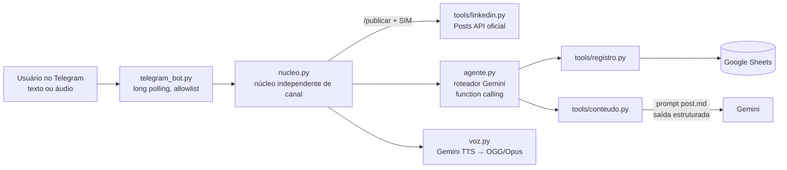

# Ultron: agente de IA pessoal para a rotina de carreira no LinkedIn

> 🇺🇸 [Read in English](README.md)

O Ultron é um agente de IA pessoal que conduz de ponta a ponta uma rotina de crescimento no LinkedIn: registra as atividades do dia a partir de texto ou áudio, acompanha metas semanais no Google Sheets, transforma aprendizados falados em rascunhos de post e publica os posts aprovados pela API oficial do LinkedIn. O uso diário é por um bot no Telegram, com respostas em voz.

Ele foi criado para apoiar um desafio de LinkedIn de 7 dias e uma rotina diária de 15 minutos baseada em quatro comportamentos: marca profissional, encontrar pessoas, engajar com insights e construir relacionamentos.

## O que ele faz

- **Registra o dia por voz ou texto.** "Hoje mandei 25 convites, 18 para recrutadores, e fiz 3 comentários" vira uma linha na planilha. "Na verdade foram 20" corrige; "mais 10 convites" soma.
- **Mostra a performance da semana** frente às metas, destacando o que está mais atrasado.
- **Transforma um áudio em rascunho de post**, seguindo um guia de estilo e uma regra rígida de fidelidade: nunca inventa métricas, e tudo o que falta ou foi generalizado é sinalizado para revisão.
- **Ciclo de revisão:** ajustar, aprovar ou descartar o rascunho pelo chat.
- **Publica no LinkedIn** pela API oficial, só depois de uma confirmação explícita em duas etapas.
- **Responde em voz** (TTS do Gemini, com uma voz original pré-definida), com legenda para leitura rápida.

## Arquitetura

## Decisões de design

**Humano no loop para ações irreversíveis.** Publicar não é uma ferramenta disponível para o modelo. Só acontece pelo comando determinístico `/publicar` seguido de um "SIM" explícito, então uma mensagem mal interpretada nunca publica nada.

**Em conformidade com os termos do LinkedIn por design.** O LinkedIn não oferece APIs para pessoas físicas enviarem convites ou comentarem em posts de terceiros, e automação de navegador para isso viola o Contrato do Usuário. O Ultron faz o trabalho de pensar (rascunhos, notas, acompanhamento) e deixa esses cliques para o usuário. A publicação usa o produto oficial "Share on LinkedIn", com OAuth 2.0.

**Proteção contra alucinação no prompt.** O prompt de posts prioriza fidelidade sobre estilo e dá ao modelo uma saída legítima: informação faltante vai para o campo `alertas`, em vez de ser inventada. Os exemplos few-shot são marcados explicitamente como referência apenas de estilo.

**Exibição determinística do conteúdo gerado.** Os rascunhos são impressos pelo código a partir de um buffer, e não repassados pelo modelo roteador. Assim, o usuário sempre vê exatamente o que foi gerado.

**Aritmética em vez de busca na planilha.** Planilhas guardam datas como números seriais (dias desde 30/12/1899). A linha de qualquer dia é calculada como `5 + (data - início).days`, sem depender do formato de data da localidade.

**Noção de tempo.** A data e a hora atuais (America/Sao_Paulo) são injetadas em cada mensagem, então "hoje" e "ontem" são resolvidos corretamente mesmo em conversas que atravessam a meia-noite.

**Resiliência a quedas do modelo.** Erros temporários (429/5xx) são repetidos com espera exponencial e variação aleatória. Se o modelo principal continuar indisponível, o agente troca para um modelo reserva (Gemini Flash-Lite) mantendo o histórico da conversa, e volta ao principal na mensagem seguinte.

**Idempotência nas falhas.** Ferramentas com efeito colateral são rastreadas a cada mensagem. Se um modelo falha depois de uma ferramenta já ter rodado (por exemplo, depois de registrar na planilha), a mensagem não é repetida: o usuário recebe um resumo do que foi feito, montado pelo código, e o modelo é avisado na rodada seguinte, evitando registros duplicados.

**Núcleo independente de canal.** Todo o comportamento fica em `nucleo.py` e `agente.py`. O Telegram é um adaptador; adicionar WhatsApp ou outro canal não muda o agente.

## Stack

Python · Google Gemini API (`google-genai`: function calling, saída estruturada com Pydantic, entrada de áudio nativa, TTS) · Google Sheets API (`gspread`, service account) · LinkedIn API (OAuth 2.0, Posts API) · Telegram Bot API · PyAV (codificação Opus)

## Como rodar

1. `python -m venv .venv`, ative o ambiente e rode `pip install -r requirements.txt`.
2. Copie o `.env.example` para `.env` e preencha as chaves (Gemini, service account do Google, ID da planilha, app do LinkedIn, bot do Telegram).
3. Compartilhe a planilha de acompanhamento com o e-mail da service account.
4. Rode `python linkedin_auth.py` uma vez para autorizar a publicação (o token dura cerca de 60 dias).
5. `python telegram_bot.py` (ou `python cli.py` para usar no terminal).

As credenciais nunca são versionadas: `.env`, `credenciais/` e os registros locais de posts são ignorados pelo Git.

## Próximos passos

- CRM de contatos no Sheets: quem conectar, por quê, status e lembretes de follow-up
- Lembretes proativos ("a rotina de hoje ainda não foi registrada")
- Conjunto de avaliação para medir qualidade e fidelidade dos rascunhos entre modelos
- Deploy na nuvem (Cloud Run), com o estado fora do disco local
- Canal de WhatsApp (adaptador já pensado sobre o mesmo núcleo)

## Autor

**Gustavo Araújo André**, Senior Data Scientist, trabalhando com pipelines preditivos e ML em produção.
[LinkedIn](https://www.linkedin.com/in/gustasandre)